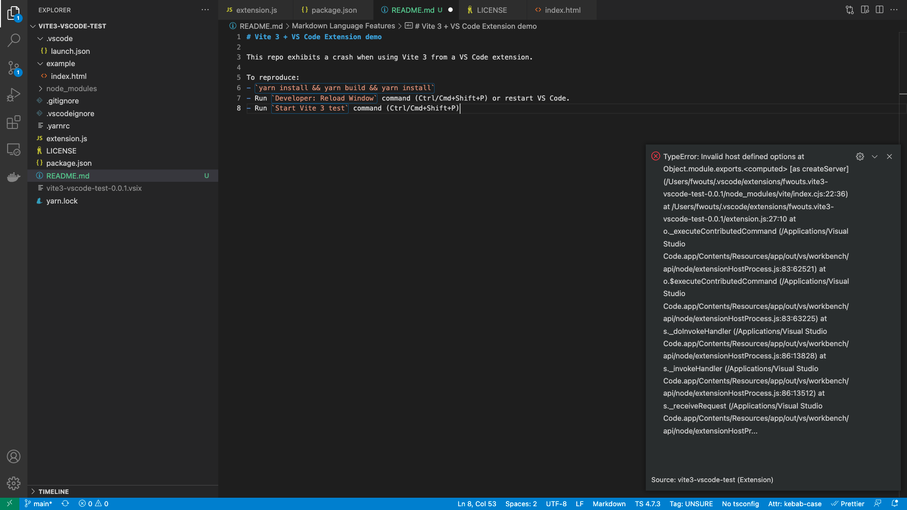

# Vite 3 + VS Code Extension demo

This repo exhibits a crash when using Vite 3 from a VS Code extension.

To reproduce:

- `yarn install && yarn build && yarn install`
- Run `Developer: Reload Window` command (Ctrl/Cmd+Shift+P) or restart VS Code.
- Run `Start Vite 3 test` command (Ctrl/Cmd+Shift+P)
- Witness the crash (see below).

